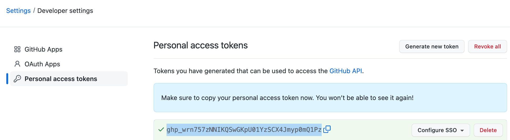

# Setting Up an Account on Github
This tutorial will show you how to create an account on Github and generate a Personal Access Token that can be used to checkin changes to a repository on your Cloud9 instance.

1. Create a GitHub account
[Create an account](https://github.com/signup) on GitHub if you don't have one already.

2. Set up a Personal Access Token for your Github account
   - First Select your picture or identifier in the upper right corner of the github window and select "Settings"

   - Scroll down to select "Developer Settings" in the bottom left of your settings page

   - Select "Personal Access Tokens" on the bottom left of this page

   - Select "Generate a new Token", create a Note to identify the token and specify "Repo" scope.
   
   - Select "Generate Token" and you will see the new Personal Access token in the middle of the screen.  Save it somewhere because you will be using it many times through the semester.  You will need it every time you access a github repo.  If you lose it, you can generate a new one so all is not lost, but you will find it better if you save it in a google doc or a note on your laptop.
    
