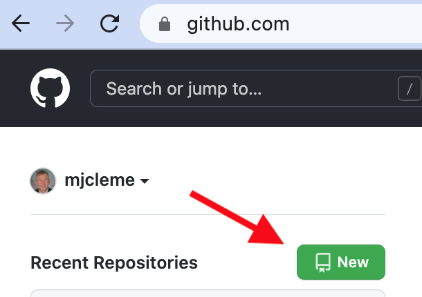
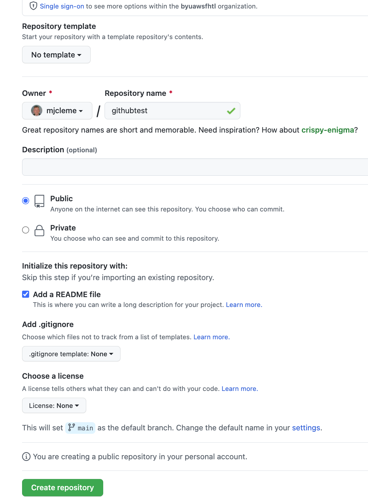
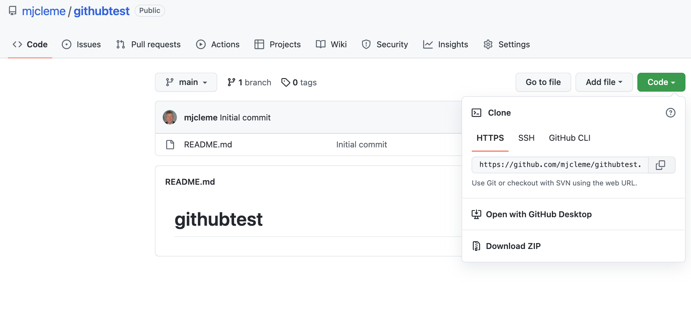
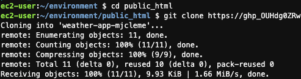
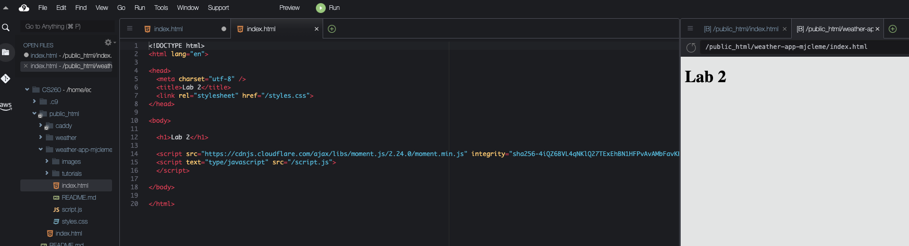
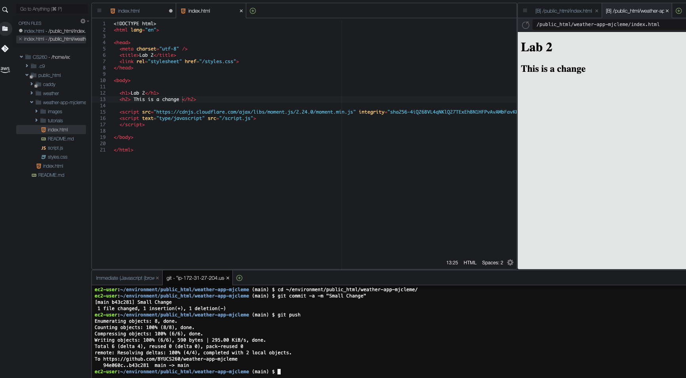
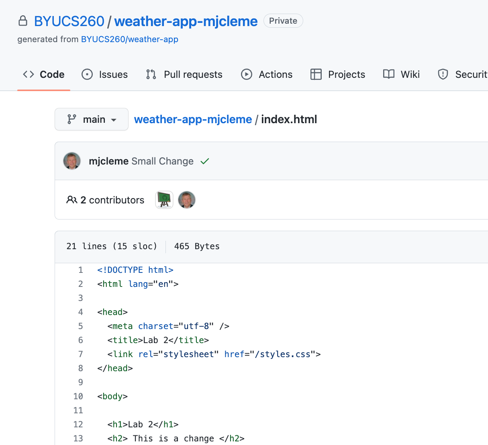

# Working Together on Creative Projects
You will want to have a shared code base for your creative projects.  
Although you could email a zip file back and forth, you will run into a 
lot of problems and it will be difficult to recover when something breaks.

When you put your code into a github project, you can each check out the 
current version and check in versions that your partner can see.

This tutorial will give you the basics, but there are a lot of other features 
that we will go over as the semester progresses.

1. [Create an account and get a Personal Access Token](Account.md)

2. Create a new repository by selecting the "New" button.


3. Call it "githubtest".  Add a Readme.md file and make it visible to the public so that the TAs can grade it.


4. Go to the "Code" button for your new repository and copy the URL for the repository.


4. Configure git in your Cloud9 instance
If you haven't done this already, you should configure git with your name, email address, and preferred editor.
```
git config --global user.name "Daniel Zappala"
git config --global user.email daniel.zappala@gmail.com
```
Be sure to substitute your own name and email address.

5. In your terminal pane on the bottom of the Cloud9 console, change directory to your public_html folder.
```
cd ~/environment/public_html
```

6. Clone the repository onto your Cloud9 instance using the URL from the "Code" button and your Personal access token. Replace "YourPersonalAccessToken" with the Personal Access Token you generated in github and replace "yourgitid" with your id.
```
git clone https://YourPersonalAccessToken@github.com/yourgitid/githubtest.git
```
 

7. Create an index.html in your cloned folder, save the change, and preview the changes
 

8. Now push the changes back to github
```
cd ~/environment/public_html/githubtest/
git commit -a -m "New Index.html"
git push
```
 

9. You should now be able to see the changes in your github browser window.



Congratulations!  You will be saving all of your labs and creative projects in git for the rest of the class.  You will follow this same process for each assignment.

