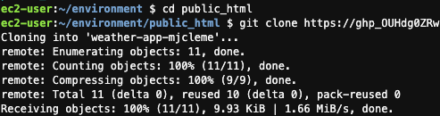
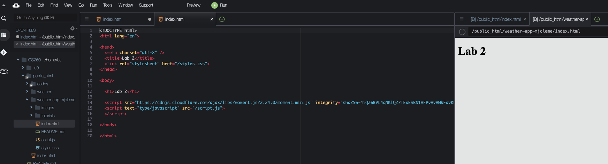

# Github Tutorial
Learning to use version control is absolutely essential for a programmer. If you are not using some kind of version control system already, then you should immediately start using one. Version control ensures that you can always retrieve an older version of your code in case you need to retrieve some code you have deleted. Storing your repositories in the cloud ensures that you won't lose your code, which should be one of your most precious possessions. 

Git is the preferred tool for many developers because it handles [distributed version control](http://git-scm.com/book/en/Getting-Started-About-Version-Control) so well. Outside of university projects, it is most common to work on teams when writing code, so a tool like Git that provides easy collaboration is required. It is quickly becoming a de facto standard so it is useful to understand at least its basics. Git is supported by most online software repositories, like [GitHub](https://github.com/) and [BitBucket](https://bitbucket.org/).

## Github Basics
In this tutorial, we are going to show you the minimum subset of Github commands that are necessary to complete the lab for this week.  This [tutorial](github-advanced.md) will give you a deeper understaning of the more advanced Github features if you have time to explore.

1. [Create an account and get a Personal Access Token](Account.md)
2. Create a new private git repo for the ["Weather App Lab"](https://byu.instructure.com/courses/15698/assignments/598439?module_item_id=1334017)
 from Canvas.

The URL for the repo should look something like 
```
https://github.com/BYUCS260/weather-app-yourgithubid
```
3. Configure git in your Cloud9 instance
If you haven't done this already, you should configure git with your name, email address, and preferred editor.
```
git config --global user.name "Daniel Zappala"
git config --global user.email daniel.zappala@gmail.com
```
Be sure to substitute your own name and email address.

4. In your terminal pane on the bottom of the Cloud9 console, change directory to your public_html folder.
```
cd ~/environment/public_html
```

5. Clone the repository onto your Cloud9 instance using the URL from github classroom and your Personal access token. Replace "YourPersonalAccessToken" with the Personal Access Token you generated in github and replace "yourgitid" with your id.
```
git clone https://YourPersonalAccessToken@github.com/BYUCS260/weather-app-yourgitid
```
 

6. Change the index.html in your cloned folder, save the change, and preview the changes
 

7. Now push the changes back to github
```
cd ~/environment/public_html/weather-app-yourgitid/
git commit -a -m "Small Change"
git push
```
 

9. You should now be able to see the changes in your github browser window.


Congratulations!  You will be saving all of your labs and creative projects in git for the rest of the class.  You will follow this same process for each assignment.
